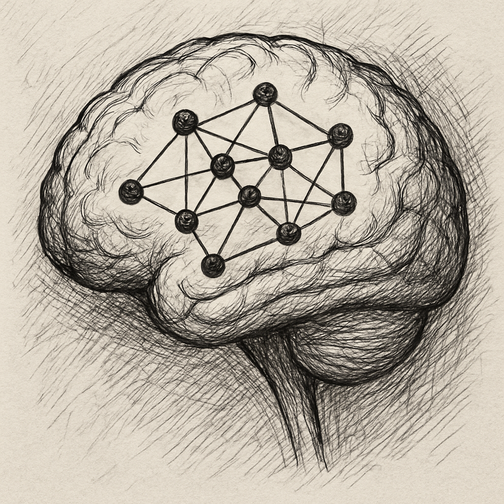

# neural-circuit-lab

In this repository, [@LeonardVetter](https://github.com/LeonardVetter) and me are collecting our code to model simple network architectures to play with and understand their properties and dynamics.
